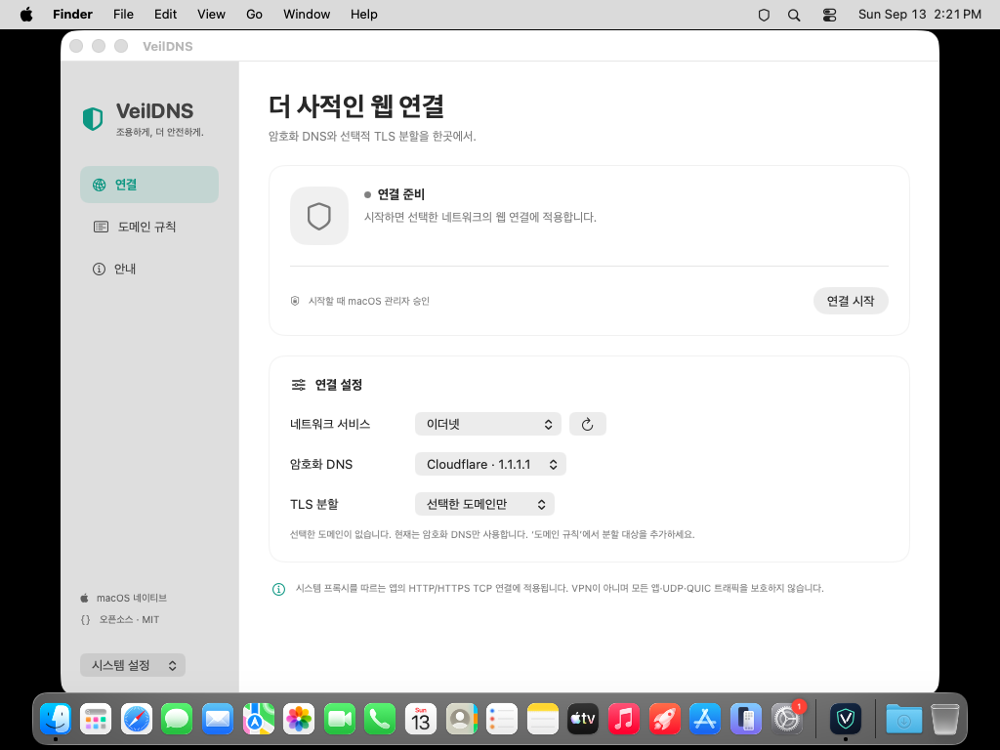

# VeilDNS

**macOS에서 DNS over HTTPS와 선택 도메인 SNI 분할을 사용하는 오픈소스 앱.**

[](https://github.com/seungminkangg/veildns/actions/workflows/ci.yml)
[](LICENSE)

SwiftUI 메뉴 막대 앱과 Rust 네트워크 엔진으로 구성합니다. [시크릿DNS](https://secretdns.kilho.net/)의 공개 기능에서 영감을 받은 독립 구현이며, 길호넷의 공식 macOS판이나 제휴 제품이 아닙니다. 원본 코드·바이너리·브랜드 자산을 사용하지 않습니다.



> **Preview**: macOS 15 이상, Apple Silicon 및 Intel. 공개 소스와 macOS 자동 검증을 제공합니다. 현재 배포 파일은 ad-hoc 서명이며 Apple 공증을 받은 앱이 아닙니다. 실제 사용자의 Mac, 브라우저 및 통신사 환경에 대한 검증 현황은 [검증 기록](docs/VALIDATION.md)을 확인하세요.

## 설치와 사용

1. [Releases](https://github.com/seungminkangg/veildns/releases)에서 Mac에 맞는 ZIP을 받습니다. Apple Silicon은 `arm64`, Intel은 `x86_64`입니다.
2. 압축을 풀어 `VeilDNS.app`을 응용 프로그램 폴더로 옮깁니다. Preview가 Gatekeeper에서 차단되면 [Apple의 확인되지 않은 앱 열기 안내](https://support.apple.com/en-us/102445)에 따라 시스템 설정의 개인정보 보호 및 보안에서 해당 앱을 검토한 뒤 허용할 수 있습니다.
3. 앱에서 사용할 네트워크 서비스와 DNS 서버를 선택합니다. 기본 DNS는 **Google · 8.8.8.8**이고, SNI 분할은 기본적으로 **모든 HTTPS 연결**에 적용됩니다. 특정 도메인만 적용하려면 분할 모드를 바꾸고 도메인을 한 줄에 하나씩 입력합니다.
4. 연결을 누르고 macOS의 관리자 인증 창을 확인합니다. **인증은 처음 한 번만 필요합니다.** 승인하면 관리자 도우미가 설치되어 이후 연결에는 비밀번호를 묻지 않습니다. 실제 엔진 준비와 프록시 적용이 확인된 뒤 연결 상태가 표시됩니다.
5. 연결 해제 또는 앱 종료 시 해당 세션이 변경한 프록시 값을 복원합니다. 이전 세션의 복구가 필요하면 앱의 복구 기능을 사용합니다.

비밀번호는 macOS 인증 창에서만 입력합니다. VeilDNS는 관리자 비밀번호를 저장하지 않습니다. 기존 VPN·PAC·인증 프록시와의 충돌은 임의로 덮어쓰지 않고 알려줍니다. 권한 유지를 끄려면 앱의 정보 화면에서 **권한 유지 해제**를 누릅니다.

## 하는 일

- Google 또는 Cloudflare DoH로 프록시 대상 호스트의 A/AAAA 주소를 확인합니다. 기본값은 Google입니다. 고정 bootstrap 주소, TLS 인증서 검사, 시스템 프록시 제외, 평문 DNS로 자동 대체하지 않는 경로를 사용합니다.
- 로컬 HTTP/HTTPS CONNECT 프록시를 `127.0.0.1`에만 엽니다. HTTPS 인증서 설치나 TLS 본문 복호화는 하지 않습니다.
- 전체·지정 목록·끄기 중 SNI 분할 모드를 선택합니다. 기본값은 전체이며 예외 목록이 우선합니다. TLS ClientHello의 SNI 내부에서 TLS record를 나누고 handshake 내용은 그대로 유지합니다.
- 네트워크 서비스별 프록시 원본을 저장합니다. 앱과 엔진을 감시하는 권한 helper가 비정상 종료 때도 자신이 설정한 값만 복구합니다.
- 관리자 인증은 도우미를 설치하는 첫 1회에만 필요합니다. 설치한 사용자 계정만 그 도우미를 사용할 수 있습니다.
- 도메인·URL·HTTPS 본문을 방문 기록으로 수집하거나 원격 분석 서버에 전송하지 않습니다.

도메인 예: `example.com`, `*.example.com`. 지정 목록 모드에서 목록이 비어 있으면 SNI 분할은 수행되지 않습니다. DoH는 프록시를 거치는 외부 호스트 연결에 적용됩니다.

macOS 시스템 DNS에도 암호화를 적용하려면 [선택 DNS 프로파일 설치 안내](docs/SYSTEM_DNS.md)를 참고하세요. Cloudflare·Google 프로파일은 앱에 포함되어 있으며 직접 설치·제거합니다. 이 설정은 앱 연결과 독립적이므로 **앱을 꺼도 유지됩니다**.

## 적용 범위

| 트래픽 | 동작 |
| --- | --- |
| macOS HTTP/HTTPS 프록시를 따르는 앱 | DoH와 설정에 따른 TLS SNI 분할 |
| 시스템 프록시를 무시하는 앱·직접 소켓 | 이 프록시의 범위 밖 |
| QUIC/HTTP/3, UDP | 이 프록시의 범위 밖. 브라우저의 TCP 전환 여부는 해당 브라우저 동작에 따름 |
| IP로 직접 연결 | DNS 질의 없음. TLS SNI 유무와 설정에 따라 분할 |
| 로컬·사설망 대상 | 엔진에서 기본 차단. macOS의 기존 프록시 예외는 유지 |
| 일반 HTTP | 프록시 전달. HTTP 본문 자체의 암호화를 추가하지 않음 |

VeilDNS는 VPN, IP 익명화 도구 또는 모든 DPI 장비에 대한 성공 보장이 아닙니다. TLS record 분할은 TCP 패킷 경계 보장이나 SNI 암호화와 다릅니다. 사이트 호환성 문제가 있으면 예외 목록에 추가하거나 분할을 끄세요. [분석 및 설계 근거](docs/RESEARCH.md)에서 원본과의 차이를 설명합니다.

## 소스에서 빌드

Mac에 Xcode 26.6 이상의 명령행 도구와 [Rustup](https://rustup.rs/)이 필요합니다. Rust는 저장소의 `rust-toolchain.toml`로 1.98.1에 고정합니다. 앱은 Swift 6 언어 모드와 macOS 15 API를 사용합니다.

```bash
git clone https://github.com/seungminkangg/veildns.git
cd veildns
cargo test --manifest-path engine/Cargo.toml --locked
swift test --package-path macos
bash scripts/build-macos.sh
open build/VeilDNS.app
```

빌드 스크립트는 앱, 엔진, 권한 helper, 아이콘과 의존성 라이선스 고지를 묶고 서명을 검증하여 `dist/`에 ZIP과 SHA-256을 만듭니다. 서명·공증 방법은 [배포 안내](docs/DISTRIBUTION.md)를 참고하세요.

## 엔진만 사용

```bash
cargo build --manifest-path engine/Cargo.toml --release --locked
engine/target/release/veildns-engine --check-config examples/config.json
engine/target/release/veildns-engine --config examples/config.json
```

별도 터미널에서 명시적으로 프록시를 사용합니다. 이 방법은 시스템 설정을 바꾸지 않습니다.

```bash
curl --proxy http://127.0.0.1:8080 https://example.com/
python3 scripts/smoke-proxy.py engine/target/release/veildns-engine
```

## 구조와 기여

```text
macos/        SwiftUI 앱, 설정 모델, SystemConfiguration helper, Swift 테스트
engine/       Tokio/Hyper HTTP 프록시, DoH, TLS 파서, Rust 테스트
scripts/      앱 패키징, 라이선스 고지 생성, 실제 HTTPS 연결 검증
docs/         원본 분석, 배포·보안·검증 기록
```

[CONTRIBUTING.md](CONTRIBUTING.md) · [SECURITY.md](SECURITY.md) · [MIT 라이선스](LICENSE)

**English:** VeilDNS is an independent, open-source macOS menu bar app that provides DNS over HTTPS and selective TLS ClientHello record fragmentation through a loopback HTTP/CONNECT proxy. It preserves end-to-end TLS and restores only the system proxy values it owns. It covers applications that honor macOS web proxy settings; it does not intercept all device traffic or support UDP/QUIC. Preview builds are ad-hoc signed, not Apple-notarized. See the linked verification record for tested behavior and outstanding device acceptance.
